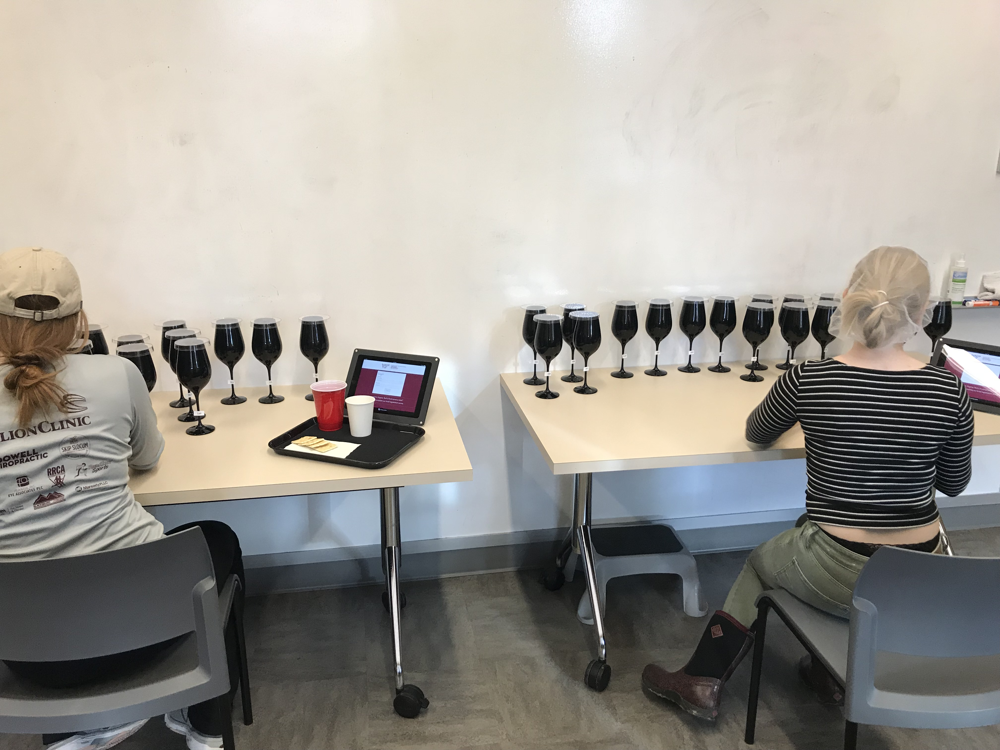

What is "sensory testing" (also called "sensory evaluation")? This means getting people’s reaction to a food product in terms of how it tastes, smells, looks, feels, and/or sounds, and then using this information to make data-informed decisions. We want to help provide wine- and cider-makers in Virginia, like you, with **this free toolkit**--a step-by-step guide to teach you how to use it. 

{width=75%}

In this interactive toolkit, we explain how to design, run, analyze, and use the results from a specific type of sensory test: **"discrimination testing"**, which allows you to determine whether processing or ingredient changes will lead to noticeable changes in your product.  

You'll notice 3 of tabs in this toolkit--if you follow through each of them, you'll learn how to design a test, how to collect data, and how to analyze the data using this toolkit.  If you're already familiar with these kinds of tests, and you just want to analyze data you've already collected, you can skip right to the "discrimination test analysis" tab above or by clicking [here](app.qmd).

This toolkit was designed and supported through funding from the Virginia Tech College of Agricultural and Life Sciences 2024 Seed Grant Program *“Determining and meeting the sensory evaluation needs of VA wine and cider makers”*.  In a survey conducted of Virginia wine- and cider-makers in late 2025/early 2026 (IRB 25-788), as part of this funding, respondents indicated that discrimination testing was one of their top needs, and this toolkit is meant to address those needs.

## Why conduct a sensory test at all?

As someone who works in the wine or cider industry, it's likely that you frequently change raw materials--source apples or grapes from different plots--or processing equipment--perhaps changing your pressing equipment, or scaling up to larger fermenter batches.  These are all real differences--something is different.  But the question is whether these changes lead to **noticeable sensory differences** in the product.

(Oh, you might say, we know there *is* a difference in ºBrix or volatile acidity... but depending on the product, measurable chemical or physical differences don't always result in sensory differences that consumers notice.  We use sensory evaluation to bring in "human instruments" to determine whether known differences in some process, ingredient, or parameter lead to these noticeable sensory differences.)

## The categories of sensory evalaluation

Typically, there are **three basic questions/goals** of sensory tests:

1.  Discrimination :arrow_left: *what this toolkit will cover*

    In **discrimination testing**, we test whether processing or ingredient differences lead to a noticeable difference.

2.  Descriptive

    In **descriptive testing** (often called Descriptive Analysis), we quantify the differences among products that we know are different.
    
3.  Affective

    In **affective testing**, we test larger groups of consumers to see how they respond--positively, negatively?--to products we know are different.
    
## Production goals

The categories above are very basic types of research questions: is there a difference? What kind? How do people feel about it?

In the real world, these research questions are applied more specifically.  For example, we might want to determine whether people notice a change in grape blends (is a change from 45/55 to 50/50 Merlot/Cabernet Sauvignon noticeable?) or to determine whether a batch of cider that took longer to ferment than usual is noticeably different from the brand standard.  Perhaps you want to be able to sell your product in both glass 750 mL bottles and 16-oz aluminum cans: will the same product taste different after a month stored in each of these containers?  **These goals can be addressed using discrimination testing.**

Click the **next tab** to learn how to conduct a simple and flexible discrimination test--the "tetrad test".

## Further Reading

To learn more about sensory evaluation in general, we recommend the following resources (which are online or can be acquired affordably on the secondary market):

- Lawless, H. T., & Heymann, H. (2010). *Sensory Evaluation of Food: Principles and Practices (Second)*. Springer.
- Society of Sensory Professionals [Knowledge Center](https://www.sensorysociety.org/knowledge/Pages/default.aspx)