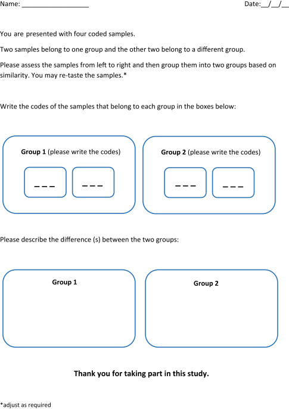

So far, we've talked about what you can do with a general discrimination test. In fact, there are many specific discrimination tests, all of which involve testing a similar, basic question:

> When samples are presented without identifying information, can panelists identify which sample or samples are different?

Notice that we write "**panelists**" above: a key principle of sensory testing is that no one person, no matter how well-trained or expert, is accurate all the time or for every product. Therefore, we use a group of subjects to conduct a sensory test, and we use statistics to determine the strength of the results we observed--to update our understanding of the differences (or not!) between the products. This helps avoid drawing wrong conclusions just because someone had an off day or got very lucky.

![Presentation of samples for a water-quality *triangle* test. This picture presents a key cautionary example: don't give your panelists extra clues about the different sample: here "183" is obviously different[^1].](img/triangle-test-example.jpg){#badexample width=75%}

## General procedure for conducting a discrimination test

In general, a discrimination test requires the following:

*  **Definition of the test objective**: what difference are you trying to quantify?  Ask yourself how sure you are that a difference between the samples will be found. Examining our prior beliefs helps us calibrate the test.
*  **Sample preparation**: anonymize samples and prepare to present them in a consistent fashion
*  **Panelist recruitment**: typically we need at least 20 subjects to participate, and more than 40 is preferred. In addition, it is usually a good idea to have panelists who do not all work in the winery or cidery--experience leads to expertise with the product.
*  **The test(!)**: present the samples in the appropriate fashion (see below for a specific, recommended method), which will involve "anonymizing" samples (masking their identity in a way you can keep track of), and collecting responses in a "ballot".
*  **Analyze the data**: use appropriate statistics (or a toolkit like this one!) to determine what the combination of your prior hypothesis and your observed data tells you about the actual range of possible difference between the two samples.
*  **Make interpretations**: based on the observed results and subsequent statistical output (which typically gives a range of compatible true probabilities of discrimination), determine the risk of accepting that the samples are or are not different.

## The "tetrad" test: Our recommended discrimination test

There are many test procedures that follow the basic steps above, but rather than debate specific use cases or advantages, we are going to simply recommend that wineries and cideries use the **tetrad test** procedure. [For reasons that are beyond the scope of this toolkit](https://www.sensorysociety.org/meetings/2016%20Presentations/W_SM_Kamerud.pdf), the tetrad test is more powerful than comparable tests, and has the advantage of being easy to set up and to present to panelists. We think this makes it ideal for use in a winery or cidery environment

{width =75%}

The test is called the "tetrad" test specifically because it involves presenting each panelist with *four*, anonymized samples: two of sample A and two of sample B. The panelist must then correctly group the two A and two B samples together.

### The specific procedure for the tetrad test {#specific-procedures}

1.  Write down--before you start!--whether you expect the subjects to notice a difference or not, and how certain you are. This can be subjective (in fact it has to be) but it is important to write this down before you gather results. It tells you something about your impression of how big a change you're expecting to see, and will be used to calculate your results.
1.	Prepare worksheets/scoresheets before the test. The worksheets should ask assessors to group the four samples into two groups of two based on similarity.
2.	Make sure each sample is served in the same amount (e.g., 20-30mL), in the same kind of container, and at the same temperature. Each of the four samples should be labeled individually and anonymously, (e.g., with 3-digit codes, such as "123" for the first A, "334" for the second A, and so on). Don't create differences between your samples unintentionally, [say by using two different colored markers for A and B samples.](#badexample)  
3.  Present all 4 samples to a subject at the same time, in a randomized sequence. That way, not all panelists will taste the first A first, which might bias the results.

    Use an equal number of the six possible sequences of the two products (A and B): 

    `AABB / ABAB / BBAA / BABA / ABBA / BAAB`

    Distribute these at random among assessors to achieve a balanced serving order.
    
3.	Instruct assessors to taste the samples in the order presented.
5.	In this test, assessors must make a choice. Answers such as “no difference” or “all samples are different” are not acceptable. Assessors who reported any of those answers should be instructed to group the samples into two pairs randomly. The assessors can write that the selection was only a guess in the comment section of the scoresheet (although this information will not be used further, it helps the assessors make their selection).
5.  Compile the results into a single notebook/report. The key elements to record are:
    1.  The identity of the samples tested.
    2.  The number of subjects who got it right: how many subjects got AA and BB together?
    3.  The total number of subjects who participated.
    4.  Your prior hypothesis, which you recorded before you started.
    
### A few other notes on the procedure:

*  **Do not ask questions about preference/liking/how different the samples are** after the initial sample grouping. These are different cognitive tasks than simply evaluating "is there a difference" and can bias the results.
*  **Each scoresheet should be only for evaluating one group of samples** (testing 2 products only). If you want to compare multiple sets of products, you need to use multiple sheets (and, in reality, set up multiple tests.)

If you want to know more about the tetrad test, we recommend the following [technical presentation on tetrad testing](https://www.sensorysociety.org/meetings/2012%20Abstracts/SSP2012_Ennis_et_al_Tetrad_Workshop_2a.pdf).

## Summary

On this page, you learned how to set up and conduct a tetrad test. The key element here is the [instructions for setting up and collecting the important data](#specific-procedures) you'll need for the next page: the number of subjects, the number of subjects *who got the right answer*, and your prior hypotheses.

Review this page and, when you're ready, conduct your test. Then, go to the next page to analyze your results.

[^1]: Notice the different colors of ink!